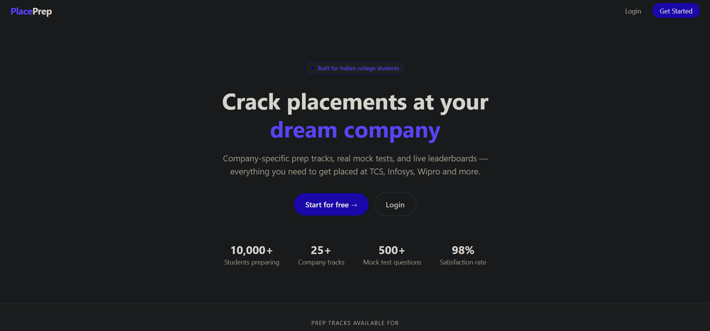
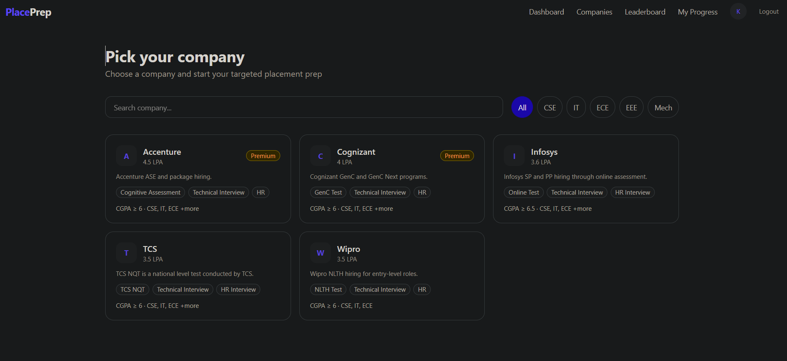
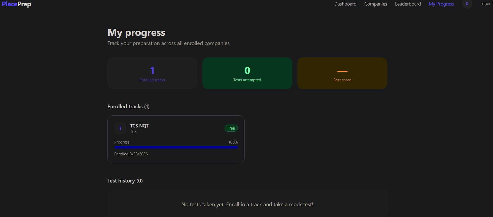
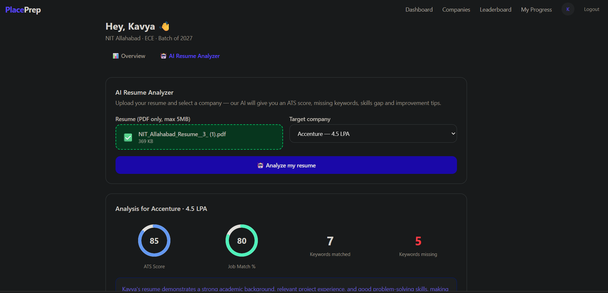
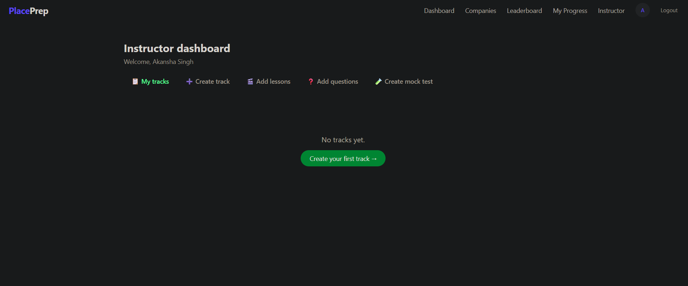
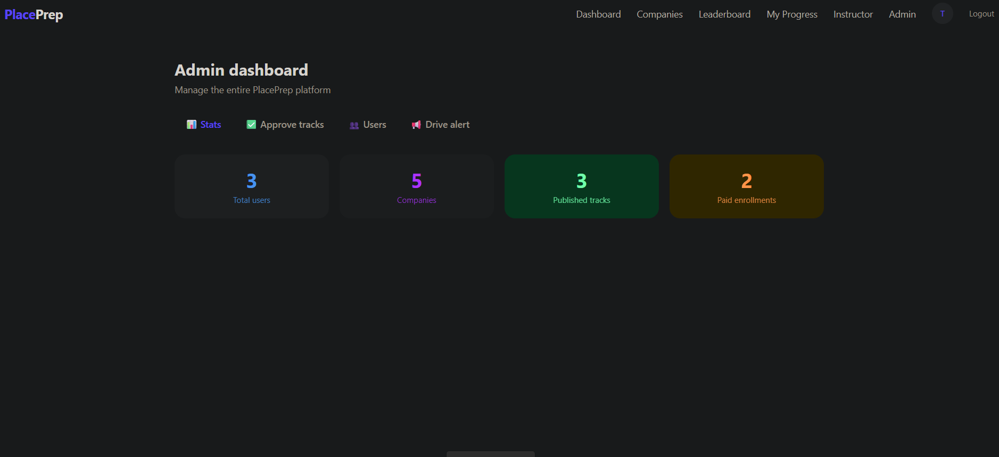

# PlacePrep 🎯

> A company-specific placement preparation platform for college students — built with the MERN stack.

  

## 📸 Screenshots

### 🏠 Home
<p align="center">
  
</p>

### 👤 User Dashboard & 📈 My Progress
<p align="center">
  
  
</p>

### 🤖 Resume Analyzer
<p align="center">
  
</p>

### 👨‍🏫 Instructor Dashboard & 🛠️ Admin Dashboard
<p align="center">
  
  
</p>

---

## 🌐 Live Demo

- **Frontend:** [https://place-prep-ten.vercel.app](https://place-prep-ten.vercel.app)
- **Backend API:** [https://placeprep-0mgp.onrender.com](https://placeprep-0mgp.onrender.com)

---

## 📌 About

PlacePrep is a full-stack placement preparation platform designed specifically for Indian college students. Unlike generic learning platforms, PlacePrep focuses on company-specific preparationans organizes all content around **company-specific tracks** — so a student preparing for TCS gets exactly what TCS tests, not generic content.

---

## ✨ Features

### 🎓 Student
- Register / Login with email+password or Google OAuth
- Browse companies with branch and search filters
- Enroll in free or premium prep tracks
- Watch YouTube-embedded video lessons
- Mark lessons complete with progress tracking
- Take timed mock tests with section-wise navigation
- View detailed score breakdown after each test
- Company-wise leaderboard with real-time rankings
- My Progress page with stats and test history
- Interview Q&A bank filtered by round
- **AI Resume Analyzer** — ATS score, missing keywords, skills gap, improvement suggestions powered by Groq (Llama 3.3)

### 👨‍🏫 Instructor
- Create company-specific prep tracks
- Add video lessons with YouTube/Cloudinary URLs
- Build MCQ question bank with explanations
- Create timed mock tests with multiple sections
- Submit tracks for admin approval

### 🛡️ Admin
- Approve or unpublish instructor tracks
- Manage user roles (student/instructor/admin)
- View platform stats — users, tracks, enrollments
- Send bulk drive alert emails filtered by branch and graduation year

---

## 🛠️ Tech Stack

### Frontend
| Technology | Usage |
|-----------|-------|
| React.js + Vite | UI framework |
| Tailwind CSS | Styling |
| React Router v6 | Client-side routing |
| Axios | API calls with interceptor |
| Context API | Auth + state management |

### Backend
| Technology | Usage |
|-----------|-------|
| Node.js + Express.js | Server framework |
| MongoDB + Mongoose | Database + ODM |
| JWT | Authentication tokens |
| Passport.js | Google OAuth strategy |
| Multer | File upload handling |
| pdf2json | Resume PDF text extraction |

### Services & APIs
| Service | Usage |
|---------|-------|
| MongoDB Atlas | Cloud database |
| Cloudinary | Video + image storage |
| Razorpay | Payment gateway |
| NodeMailer | Email notifications |
| Groq API (Llama 3.3) | AI resume analysis |
| Google OAuth 2.0 | Social login |

---

## 💡 Motivation

Many students struggle with scattered preparation resources. PlacePrep solves this by organizing preparation content based on specific companies and their hiring patterns.


## 🚀 Getting Started

### Prerequisites
- Node.js v18+
- npm or yarn
- MongoDB Atlas account
- Accounts for: Cloudinary, Razorpay, Google Cloud, Groq

### Installation

```bash
# Clone the repository
git clone https://github.com/YOURUSERNAME/PlacePrep.git
cd PlacePrep
```

#### Backend Setup
```bash
cd server
npm install
```

Create `server/.env`:
```env
PORT=5000
CLIENT_URL=http://localhost:5173
MONGO_URI=your_mongodb_connection_string
JWT_SECRET=your_jwt_secret
JWT_EXPIRES_IN=7d
GOOGLE_CLIENT_ID=your_google_client_id
GOOGLE_CLIENT_SECRET=your_google_client_secret
GOOGLE_CALLBACK_URL=http://localhost:5000/api/auth/google/callback
CLOUDINARY_CLOUD_NAME=your_cloud_name
CLOUDINARY_API_KEY=your_api_key
CLOUDINARY_API_SECRET=your_api_secret
RAZORPAY_KEY_ID=rzp_test_xxxxxxxxxx
RAZORPAY_KEY_SECRET=your_razorpay_secret
EMAIL_USER=your@gmail.com
EMAIL_PASS=your_gmail_app_password
GROQ_API_KEY=gsk_xxxxxxxxxxxxxxxx
```

```bash
# Seed the database with companies
node seed.js

# Start the server
npm run dev
```

#### Frontend Setup
```bash
cd client
npm install
```

Create `client/.env`:
```env
VITE_API_URL=http://localhost:5000/api
VITE_RAZORPAY_KEY=rzp_test_xxxxxxxxxx
```

```bash
npm run dev
```

Open `http://localhost:5173` in your browser.

---

## 📁 Project Structure

```
PlacePrep/
├── client/                  # React frontend
│   └── src/
│       ├── pages/           # All page components
│       ├── components/      # Reusable UI components
│       ├── context/         # AuthContext
│       └── services/        # API service layer
│
├── server/                  # Express backend
│   ├── controllers/         # Business logic
│   ├── models/              # Mongoose schemas
│   ├── routes/              # API routes
│   ├── middleware/          # Auth, role, premium
│   └── utils/               # Groq, Cloudinary, Razorpay, Mailer
│
└── socket/                  # Socket.IO server (real-time)
```

---

## 🗄️ Database Schema

| Collection | Description |
|-----------|-------------|
| Users | Students, instructors, admins |
| Companies | TCS, Infosys, Wipro etc. |
| Tracks | Prep tracks per company |
| Lessons | Video lessons per track |
| Questions | MCQ question bank |
| MockTests | Timed tests with sections |
| Enrollments | Student track enrollments |
| Progress | Lesson completion per student |
| Scores | Mock test results |

---

## 🔗 API Endpoints

| Method | Endpoint | Description |
|--------|---------|-------------|
| POST | `/api/auth/register` | Register new user |
| POST | `/api/auth/login` | Login user |
| GET | `/api/auth/google` | Google OAuth |
| GET | `/api/companies` | Get all companies |
| GET | `/api/tracks/company/:id` | Get tracks by company |
| POST | `/api/tracks` | Create track (instructor) |
| GET | `/api/lessons/track/:id` | Get lessons by track |
| POST | `/api/questions` | Add question (instructor) |
| GET | `/api/tests/:id/start` | Start mock test |
| POST | `/api/tests/submit` | Submit test answers |
| GET | `/api/leaderboard` | Get company leaderboard |
| POST | `/api/payments/order` | Create Razorpay order |
| POST | `/api/payments/verify` | Verify payment |
| POST | `/api/resume/analyze` | AI resume analysis |
| POST | `/api/admin/drive-alert` | Send bulk email alert |

---

## 🧪 Test Credentials

```
Admin:      admin@placeprep.com      / Test@1234
Instructor: instructor@placeprep.com / Test@1234
Student:    kavya@placeprep.com      / Test@1234
```

For Razorpay test payments:
```
Card: 4111 1111 1111 1111
Expiry: 12/26  CVV: 123  OTP: 1234
```

---

## 🤖 AI Resume Analyzer

PlacePrep includes an AI-powered resume analyzer built with **Groq API (Llama 3.3 70B)**:

- Upload your resume PDF
- Select target company (TCS, Infosys etc.)
- Get instant analysis:
  - **ATS Score** (0-100)
  - **Job Match %**
  - **Present keywords** — what you already have
  - **Missing keywords** — what recruiters look for
  - **Skills gap** with how to fill each gap
  - **Resume improvements** section by section
  - **Overall summary** and strengths

---

## 📧 Email Notifications

- ✅ Welcome email on registration
- ✅ Enrollment confirmation after joining a track
- ✅ Drive alert emails — admin can notify all eligible students when a company opens placements

---

## 🚢 Deployment

| Service | Platform |
|---------|---------|
| Frontend | Vercel |
| Backend | Render |
| Database | MongoDB Atlas |
| Media | Cloudinary |

---

## 🔮 Future Scope

- [ ] Real-time chat between students in same track
- [ ] AI-generated practice questions per topic
- [ ] Mobile app (React Native)
- [ ] College-specific leaderboards
- [ ] Interview scheduling with alumni
- [ ] Resume builder with AI suggestions

---

## 👩‍💻 Author

**Kavya Singh**
- GitHub: [@kavyasingh12345](https://github.com/kavyasingh12345)
- LinkedIn: [linkedin.com/in/kavya-singh19/](https://linkedin.com/in/kavya-singh19/)
- Email: kavyasingh19052005@gmail.com

---


⭐ If you found this project helpful, please give it a star on GitHub!